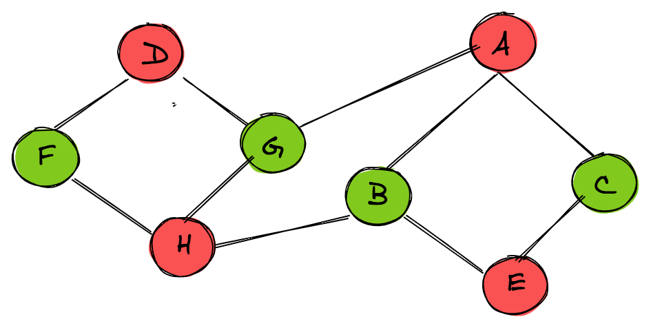
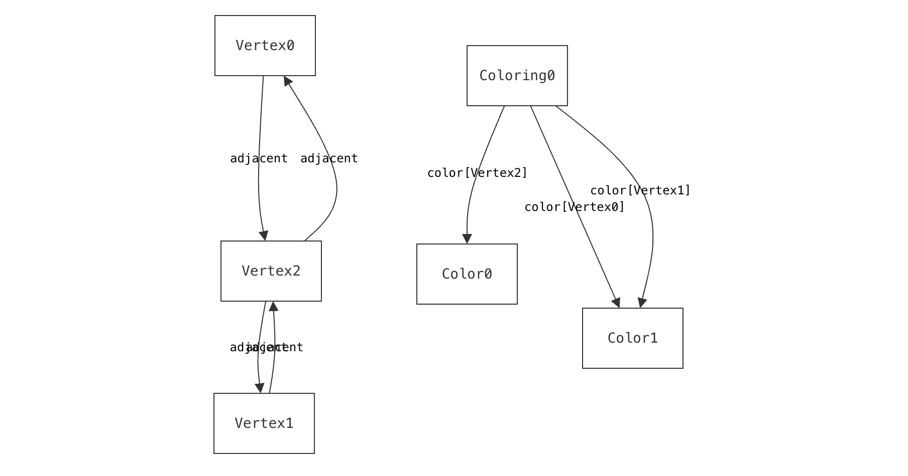
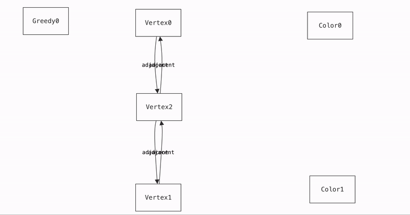

# Graph Coloring




## Project Objective

> Is it possible to assign N colors to the vertices of a graph such that no two adjacent vertices share the same color?

Such a coloring is called a graph coloring. In this project we not only explore the basic idea of graph coloring, but also model a simple greedy graph coloring algorithm. In theory, a graph can be colored if and only if it can be colored by a greedy graph coloring algorithm.

## Model Design and Signatures

We start with a simple idea for trying to color a graph with 5 vertices with 3 colors -- Red, Blue and Green. Our expected solution space is all the possible valid colorings. 

#### Graph Representation

At first, we chose to represent a graph as a list of vertices and edges.

```
sig Vertex {}

sig Edge {
 from: one Vertex,
 to: one Vertex
}
```

Where each edge has a direction, to and from, connecting one Vertex with another. Though this simple representation is possible to achieve in Froglet, we ran into issues when checking that the graph is connected (i.e. every vertex is reachable from every other vertex). Initially, we thought we could find edges where some vertex `v1` is the edge's `to` field and vertex `v2` is the edge's `from` field and check that the edges are reachable from one another if they are not the same. However, this approach still makes graph connectivity a difficult property to check for.

We then decided to switch to full Forge and represent the graph as a Vertex and a set of other vertices it is adjacent to.

```
sig Vertex {
  adjacent: set Vertex
}
```

This allows us to check connectedness easily by using the `reachable` predicate, as we can see in our `wellformed` predicate.

```
all disj v1, v2: Vertex | {
    reachable[v1, v2, adjacent]
}
```

#### Graph Color Representation

Now that we have a have a working model for a Graph, we can start thinking about how to model the coloring of the graph. We start by defining a set of colors and a function that maps each vertex to a color. To do this, we create a `Coloring` sig with a `pfunc`, as described.

```
abstract sig Color {}
one sig Red, Green, Blue extends Color {}

one sig Coloring {
    color: pfunc Vertex -> Color
}
```

Though initially we had three colors, we realized that this overconstrained our problem, because we wanted to use N arbitrary colors, so we made `Color` a non-abstract sig and removed our `Red`, `Green`, and `Blue` sigs.

Moreover, as we were thinking of developing a greedy graph coloring algorithm, we realized that we could use the `Coloring` sig to represent the state of the graph coloring at each step of the algorithm. This would allow us to check that the coloring is valid at each step and have a trace where the Coloring changes to indicate the state of the graph coloring at each step. We therefore removed `one`.

```
sig Color {}

sig Coloring {
    color: pfunc Vertex -> Color
}
```

Our last sig is `Greedy`, which represent the process of the greedy graph coloring algorithm. We have a `first` field, which represents an initial uncolored graph, and a `next`, which is a partial function that maps a `Coloring` to another `Coloring`. This allows us to represent the state of the graph coloring at each step of the algorithm. We enforce linearity of the `next` field when we run the algorithm. This completes our model!

```
one sig Greedy {
  first: one Coloring,
  next: pfunc Coloring -> Coloring 
}

run {
    ...
} ... for {next is linear}
```

## Predicates and Visualization

We can divide our predicates into two groups: those that check the existence of a graph coloring and those that check the validity of a greedy graph coloring algorithm.

#### Part 1: Existence of Graph Coloring

- Our `wellformed` predicate checks that the graph is connected, undirected and has no self loops. Though there exist graph coloring algorithms that work with directed graphs, we thought that undirected graphs were more interesting. Furthermore, we wanted our graphs to be connected, because colorings for disconnected graphs can be reduced to colorings for each connected component of the graph. These are all choices and abstractions that we have built into our model.

- Our `wellformed_colorings` predicate checks that the coloring is valid. This means that no two adjacent vertices share the same color. We also check that the coloring is complete, i.e. every vertex has a color. This is the essence of graph coloring.

When run together, for N vertices and M colors, we get all the possible colorings of graphs with N vertices and M colors. If a graph with N vertices cannot be colored with M colors, we get UNSAT. Sterling gives us a nice visualization.

```
run { 
  wellformed
  wellformed_colorings
} for exactly 3 Vertex, exactly 2 Color, exactly 1 Coloring
```

Here we can see that for exactly 3 vertices and 2 colors, we can only color the graph one way and there is only one kind of connected graph that can be colored. We see the graph to the left and the coloring of each vertex to the right!



#### Part 2: Validity of Greedy Graph Coloring Algorithm

- `initial` predicate that sets the state of the initial Coloring to have no colors map to any vertices. This predicate forms a part of the general `greedy_step` predicate, which defines the constraints of taking a step in the greedy graph algorithm. In essence, we only color a vertex if it has not been colored yet and one of its adjacent vertices has been colored.

- `coloring_trace`, which constrains the `next` field of the `Greedy` visualization to move into the next state according the `greedy_step` predicate. It is crucial that the `next` field is linear, to ensure that each step is valid. We enforce that in the `run` command.

```
run {
  wellformed
  coloring_trace
} for exactly 3 Vertex, exactly 2 Color for {next is linear}
```

Here we can see one way a greedy algorithm can color a 3-vertex graph with 2 colors. We used the "Time Projection" feature of sterling on the `Coloring` sig to get this nice gif!



## Testing and Validation

We have a number of tests that check for the correctness of our basic predicates. For example, we check that our `wellformed` predicate allows for cyclic graphs, but does not allow for unconnected or directed graphs. For our greedy algorithm, we check that indeed the only vertices that are colored in the subsequent step are the ones adjacent to those in the previous step. We can see these as being unit tests for our model.

We also test for more interesting *properties* of graph colorings. For example, no graph can be colored with one color (`one_color_impossible`) and no graph coloring can have a vertex without colors. We also an construct examples of graphs, which can always be colored with only two colors, such as trees and even-numbered cyclic graphs (`fiveVertexTree`, `cyclicEvenTwoColors` and `cyclic_graph_impossible`). Notably, we wrote a theorem that any cyclic graph can be colored with three colors (`cyclic_graph_three_colored`).

Lastly, we look at some theorems that unify both our greedy graph coloring algorithm and the predicates that check for basic existence of graph colorings. For example, we perform an inductive verification of the fact that at each step of the greedy algorithm, the coloring is invariant (`move_from_partial_coloring` and `wellformed_partial_coloring`). We also write a theorem that at some point `coloring_trace` terminates in a fully colored graph that is valid (`fully_colored_in_trace`). In conjunction with the inductive verification, this means that our greedy coloring algorithm will always find a coloring or be unsatisfiable.

Ultimately, we write a theorem stating that if there is a valid coloring, then the greedy algorithm will find it (`greedy_and_existence_equivalence`). This was the coolest part of the project -- to see two different approaches to the same problem come together in a single theorem. We enjoyed working on this model and hope you enjoy reading about it!
